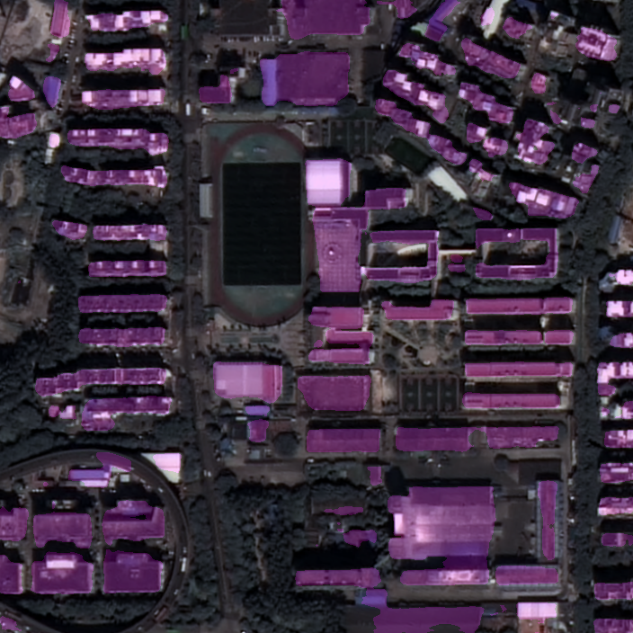

Code can run with PyTorch1.7 now, and DCNv2, ONNX are OK.  

cd DCNv2  
./make.sh  

python train.py --model=dla34 --dataset=buildings --bs=16 --iter=30000 --lr=0.01  
python val.py --trained_model=weights/dla34_40000_0.01.pth  
python detect.py --trained_model=weights/dla34_40000_0.01.pth --overlay  

